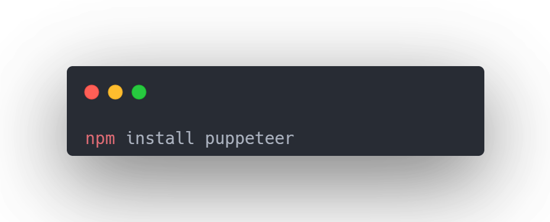
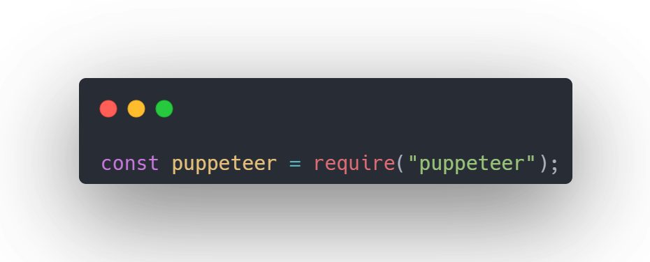
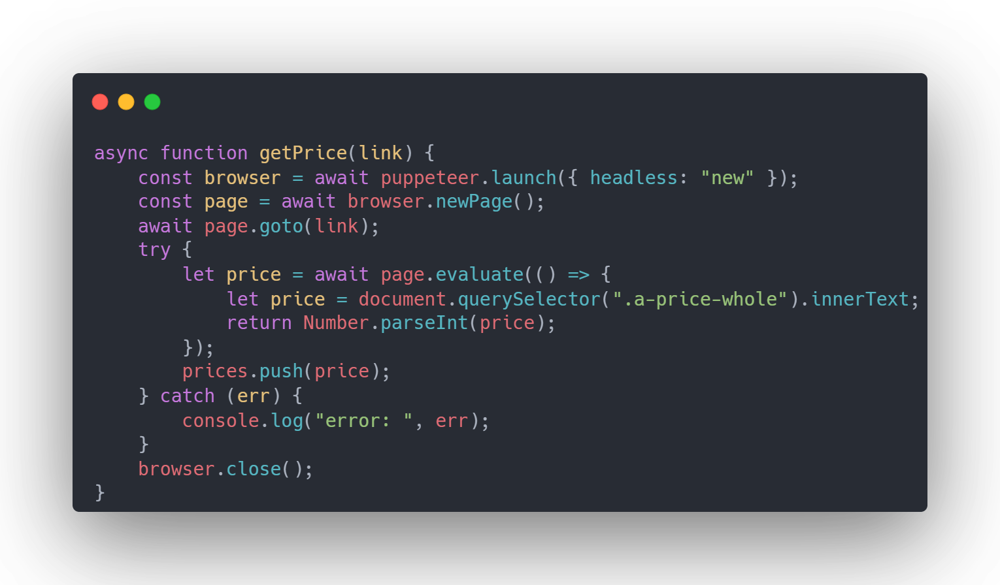
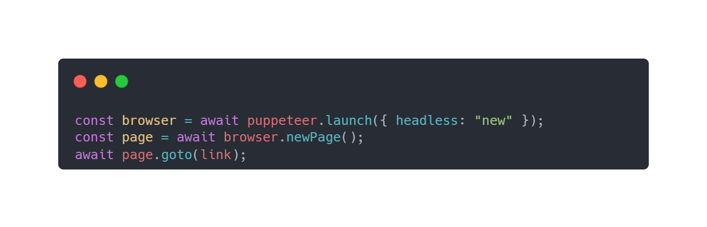
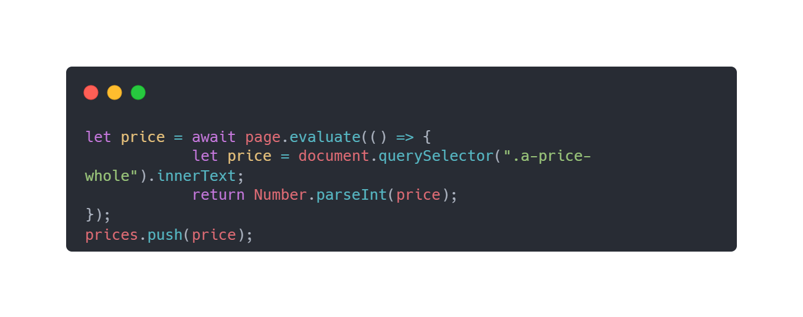
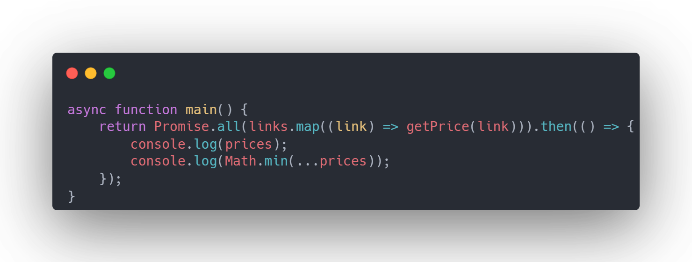

<!-- npx @marp-team/marp-cli@latest slides.md -o index.html -->

# Webscraping (with Puppeteer)

#### Bronx Science Hack Club 2024

<br>
<br>

###### By: Aaron James

---

# So you have this cool idea....

But you need some data to make it work.
You can find the data, but no affordable way to access it from your code.
At this point you can either

1. Hardcode it
2. Pay for an API (if there is one available)
3. Gather the data yourself
4. Scrape the data from the website.

---

# Web scraping is...

Programmatically getting data from a website, usually from it's HTML.

It's useful for personal projects where you just want to get something built, and not worry about API charges or rate limits.

---

The most popular web scraping libraries are BeautifulSoup and Selenium, but those are both based on python.

For Javascript, there's a library called [Puppeteer](https://pptr.dev/).

<br>

# What is Puppeteer?

A headless (no window) browser that can be controlled entirely through javascript code. It provides a set of functions to store data from HTML, take screenshots, or turn entire pages into PDFs.

---

# Getting Started

If you're on a school computer open [Replit](repl.it).

In your terminal (shell on replit), run the command on the left to install puppeteer.

`npm install puppeteer`

We're going to make a simple program to compare prices on Amazon.



---

# Importing Modules



This code tells NodeJS that you will be using the puppeteer library, and will be referring to it from the variable called puppeteer.

`const puppeteer = require("puppeteer")`

---

# Accessing Data



#### On the left is the full function to get the price from an Amazon Page

#### It's a large function, but luckily it can be broken down.

---

# Opening the Page

Firstly, we have to navigate to an Amazon listing.


In order, these lines open a browser, create a new tab, and then set the address of that tab to the link variable, which is passed as a parameter to the function.

---

# Getting the Data

<style scoped>
.notes {
 font-size: 15px;
}
</style>

Next we need to get the data from the webpage.


We call `page.evaluate();`, which takes a function as a parameter and executes it on the page asynchronously, returning whatever the function returns.

After getting the price from the website, we push it to an array called prices.

<p class="notes"> 
  The prices array doesn't exist yet, but it is just an empty array at the beginning of your program.
</p>

---

### Finally...

At the end of the function we use `browser.close();` to close the browser. This ensures that no memory is leaked.

In my case, I also wrapped the code from the previous slide in a try catch block for debugging purposes.
<br>

#### But now that we got the data, we should probably do something with it.

---

# Using the data...



To use the data we make an asynchronous function. In this function, we call the getPrices function over an array of links, using `Promise.all();`. We use `.then();` to wait for the getPrices functions to finish, and then we log all the prices and the smallest price.

---

# Extra Replit Setup

Add ` deps = [ pkgs.chromium];` to replit.nix file (3 dots > show hidden files)

```js
const { exec } = require("node:child_process");
const { promisify } = require("node:util");
```

```js
async function getPrice(link) {
  const { stdout: chromiumPath } = await promisify(exec)("which chromium");

  const browser = await puppeteer.launch({
    headless: "new",
     args: ['--no-sandbox', '--disable-setuid-sandbox'],
    executablePath: chromiumPath.trim(),
  });
```
